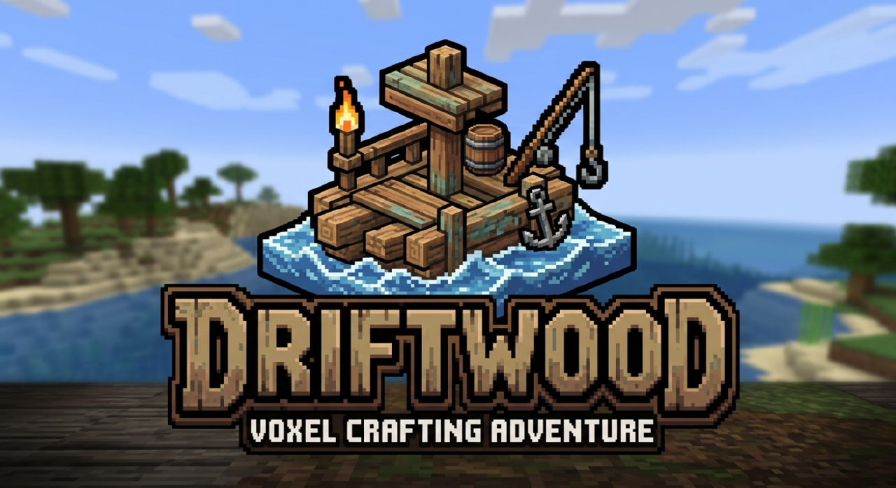

An open-world survival crafting game, built from scratch in C# on .NET 11 and OpenGL.

Spawn with nothing, punch wood, work up through tools and benches into a world where
everything is destructible. Every world is procedurally generated from a seed.

## Status

**A game you can play.** Walk into a world with nothing, mine what you can reach by hand, pick up
what it drops, and craft your way from a stick to a stormglass pickaxe. Build with it, store it in
a chest, smelt it in a furnace, light it with a lantern, dig down until the rock turns molten, close
the window and come back to it.

**438 blocks, 181 items, 161 recipes and 13 smelts** — every one of which the audit proves is
reachable from bare hands, in seven rounds, with no starting kit.

| System | State |
| --- | --- |
| Chunk storage, seeded worldgen, greedy meshing, streaming | working |
| Sunlight and coloured block light, incremental relight | working |
| Player controller — walk, jump, sneak, climb, swim, collide with shapes | working |
| Model-driven blocks — slabs, stairs, fences, doors, panes, torches | working |
| Break and place, hardness, cracking, particles, material sounds | working |
| Items, drops, a 36-slot inventory, recipes, tags, tool tiers | working |
| Workstations — bench, furnace, blast furnace, stonecutter, chests | working |
| Interface — pixel font, tabbed screens, recipe book, key rebinding | working |
| Save and load, autosave, backups, a start screen | working |
| Sky, day and night, clouds, weather particles | working |
| Creatures — four beasts, three hostiles, a cave animal, all modelled and painted here | working |
| Creature drops, sixteen colours of wool and dye, food that heals | working |
| **Flowing water and lava, buckets, swimming, burning** | working |
| **Fire and smoke — anything alight shows it, anything that dies leaves a puff** | working |
| **A texture-pack shelf and importer, in the menu** | working |
| Armour, hunger, signals, rails, farming | not started |
| Controller support | not started |

## The world

Materials with real names where a real name exists — nobody owns the word copper — and ours where
the name would have to be invented anyway.

| | |
| --- | --- |
| Ground | grass, dirt, sand, gravel, clay, snow, sandstone |
| Rock | stone, deepstone, and the coralstone / driftstone / saltstone intrusions |
| Ore | coal, copper, iron, gold, azurite, stormglass, emberstone |
| Growth | driftoak logs, leaves and planks, vines, meadowgrass, seaflax, marshlily |
| Worked | bricks, glass, smokeglass, nine cut-stone families, each with slabs, stairs and walls |

Snow lies on cold ground and on high ground, deepstone takes over below roughly y 20, and the ore
ladder runs from coal at about 0.68% of the rock it can form in down to stormglass at 0.18%. Every
one of those rates is a banded check in `--audit` rather than a number somebody liked the look of —
and each is weighed against the rock **inside its own depth band**, because a rate measured against
every rock in the world is a rate divided by how deep the world happens to be.

Ore arrives in seams rather than specks, which a rate alone cannot describe: coal averages 35 blocks
to a vein and stormglass 4. That is measured by walking the connected runs, because "one block every
250" and "a vein of eight every 2,000" are the same percentage and nothing alike to play.

## Depth

The world is **384 cells tall, and 318 of them are below sea level** — the underground is the part
that got the room. Four bands, each with its own rock, its own ores and its own reason to be careful:

| | |
| --- | --- |
| 62 .. 128 | surface and sky |
| 0 .. 62 | the ordinary underground — caves, coal, iron, copper |
| −64 .. 0 | the deep — deepstone, gold, stormglass, azurite, sliding commoner as you go |
| −160 .. −64 | the hollows — the first lava |
| −256 .. −160 | the **Emberdeep**, ending in a molten floor every world has |

Going deep is **cheaper** than standing in a field, which is not the obvious result. The streamer
loads two rings rather than one: a surface ring at the full horizontal radius covering only the
layers each column's terrain actually occupies, and a small ball around the viewer for the room they
are standing in. Far enough underground the horizon is rock, so the surface ring is dropped
altogether. Measured at radius 6: 887 chunks standing on grass, 565 in the Emberdeep, against 3,036
for a streamer that loads whole columns.

## Fluids

Water and lava flow. Break a block beside a river and it fills the space; lava falls down a shaft;
take the source away and everything it was feeding drains.

**A fluid is light.** The lighting engine already computes the least fixpoint of a monotone level
function — every cell keeps the best thing offered it and only passes it on when it improves — which
is why light can be flooded chunk by chunk in whatever order a player walks and still land on the
same answer. Flow is that fixpoint with sources instead of emitters, full strength downward, decay
sideways, and one rule of its own: **a cell that can fall does not feed sideways**. That is what
makes a river run along a channel instead of spreading into a disc.

It needs no tear-down pass, and that is worth writing down. Light needs one because a cell can be lit
by a neighbour that is lit by it. A flowing cell's level is *strictly* below whatever feeds it, or it
is fed from directly above and height strictly decreases — so the support graph is acyclic, stale
support is impossible, and re-resolving a cell from its neighbours until nothing changes reaches the
true answer on its own. Termination is a theorem rather than a hope, and so is order independence.

**Flowing fluid is never written to disk.** At rest it is a function of where the sources are and
where the solids are, and both of those are already the seed plus the diff. The obvious objection —
*I channelled lava into a moat, blocked the channel, and on reload it is gone* — is answered by the
model: it was gone before the save, because fluid cut off from a source drains. The only thing that
crosses that line is a lava source quenched into a block of coal, which is a permanent change to the
terrain and goes in the diff like anything else that cannot be undone.

Lava is a light source, so bulk lava is placed **at rest** by the generator exactly as the ocean is —
a lake, a river along a cavern floor, and the shore where it rises are all a pure function of seed and
position and cost no flow at all. Only flowing lava costs relights.

## Building

Requires the .NET 11 SDK.

```
build-release.bat
```

Or `dotnet build Driftwood.sln -c Release`. Output lands at
`src\Driftwood.Client\bin\Release\net11.0\Driftwood.exe`.

## Running

```
Driftwood.exe                          the menu, over a world it is already flying
Driftwood.exe --seed driftwood         named seed; words are hashed, digits are literal
Driftwood.exe --world stonebreak       open a named world, or make one
Driftwood.exe --ocean 10               less water; default is 25% of the surface
Driftwood.exe --chunks 24 --vsync      wider view, capped to display refresh
Driftwood.exe --audit --seed 12345     headless: generate, mesh, run every check, exit
Driftwood.exe --bench                  fly a fixed path, report frame-time percentiles, exit
Driftwood.exe --packs                  list the texture packs on the shelf, exit
```

Ocean coverage is calibrated rather than emergent: the generator samples its own height field and
shifts it so the requested share of the surface lands at or below sea level. The same request holds
across seeds, so one seed does not hand you a continent and the next an archipelago.

| Key | Walking | Flying |
| --- | --- | --- |
| Arrow keys, `WASD` | move | move |
| `Space` | jump | up |
| `Ctrl` | sneak — will not walk off a ledge | down |
| `Shift` | sprint | boost |
| Hold left | swing at the outlined block until it gives | |
| Hold right | place, or use what you are looking at | |
| `E` | your own pockets, equipment and a two-by-two | |
| `B` | fold the recipe book out beside them | |
| `Esc` | options — controls, video, audio, world, saves, packs, skins | |
| `F3` / `F5` | walk or fly / cycle the view | |

The button does not edit the world; it starts a swing, and the swing edits the world. That is why
holding one mines at a readable pace rather than at the speed of the event queue, and why there is
always something on screen causing the block to go.

Every key is rebindable, and bindings are stored as **names** rather than codes, so the settings
file can be read, checked and edited by hand without the game's input library being involved.

## Crafting

Recipes are authored as rectangles and matched against a trimmed grid, so a shape is a shape
wherever it sits. Tags — `#planks`, `#rough_stone`, `#coals`, `#logs` — let one row cover a whole
axis of materials.

Where something can be made is a separate question from whether it fits: `Recipe.Station` gates on
the workstation, and the grid still gates on size. Six things can be made in bare hands. Everything
else wants a bench, a furnace, or a stonecutter.

Tools run six rungs — wood, stone, copper, gold, iron, stormglass — across four heads, generated
from two tables rather than written out. **Tier and speed are separate columns**, which is what
makes the ladder a choice: gold is quicker than iron and reaches less far.

`--audit` walks the whole tree from empty hands and refuses to pass if anything has become
unreachable, which is what stops a recipe change quietly orphaning half the game.

## Fire and smoke

Anything alight shows it. A torch has a wick, a campfire has a fire you could cook on, a furnace
shows smoke and no flame at all — which is what a closed box looks like from outside — and the
stormglass lamp shows neither, because it is a cold light.

**A block says what it burns like** rather than an emitter holding a list of names: two numbers and
the heights they sit at, so a fourth thing that burns is data rather than a branch. A campfire is the
reference fire and everything else is a fraction of it.

Fire makes its own light rather than taking the room's, and smoke has to *spread* while it thins —
a puff that keeps its size and fades reads as a picture being turned down, one that expands reads as
air taking it. Both pass through everything, which they must: a campfire's collision box is the whole
cell, or a body could stand in the fire, so a flame born in the middle of one starts inside a solid.

Emission is a **rate**, not a count per frame. Half a second of wall clock places the same particles
whether it arrives as 15 frames or 100 — otherwise the same campfire is four times bigger on a fast
computer. Finding what is burning is a sweep on a slow clock walking chunks rather than cells;
feeding it happens every frame, because a flame lasts a third of a second.

## Creatures

Animals are modelled and painted in code, the same way the blocks are, so the game ships with its
own and needs nothing installed to have them.

A creature is a table of boxes and a palette. The art is generated per texel by turning each pixel
back into the point on the animal's surface it belongs to and colouring it there — so a marking is
a shape in space and wraps round the seams rather than stopping dead at every edge.

The skeleton layout is deliberately compatible with the nets that entity texture packs are painted
against, so a pack you already have can dress them; anything it does not carry keeps ours.

Where a thing lives takes **two questions, not one**: how dark a cell is, and whether the sky can
reach it at all. One question cannot tell a cave from a meadow at midnight — which is how a cave
animal ends up in a field — and the second is free, because sky light is what a cell would get at
noon regardless of the clock.

The dark fills gradually rather than arriving complete. An attempt every five to fourteen seconds,
each placing at most two, with the chance falling to nothing as the night fills, at twenty-four
blocks so a thing is seen crossing the ground toward you rather than appearing inside the fog. The
undead burn off at dawn, which is what makes morning a resource.

## Skins

The **SKINS** tab keeps a per-user shelf at `%APPDATA%\Driftwood\skins`. Import a PNG with the
native chooser or a typed path, move through MY SKINS to preview one on the actual layered player
model, and press enter to wear it immediately. The preview turns by drag or keyboard and remembers
classic/slim arms separately for every installed skin. A missing chosen file falls back to
Driftwood's own skin and says why.

COMMUNITY pages MineSkin's recent-public feed, and FROM PLAYER looks up a username or UUID through
mcskin.me. Both are keyless HTTPS providers. A remote skin remains only a preview until **DOWNLOAD
& USE** is chosen; then it passes through the same decoder, size limit and collision-safe shelf copy
as a local import. Provider failures leave MY SKINS usable, and no community skin is bundled with
the game.

The command-line path installs and remembers a valid skin through that same shelf:

```
Driftwood.exe --skin C:\skins\somebody.png
Driftwood.exe --skin C:\skins\somebody.png --skin-model classic
```

Exactly 64×64 or the older 64×32. Arm width is detected by looking for the texels
only a four-wide arm can reach, since a bare PNG carries that nowhere else; `--skin-model` says so
outright when a sheet is drawn ambiguously. Driftwood paints its own skin in code, so a build with
no art folder still has a player in it.

## Texture packs

Driftwood draws its own block textures, so it never needs anything else to look complete. It can
also read a texture pack you already have and use whatever that pack carries.

```
Driftwood.exe --pack C:\packs\SomePack.zip
Driftwood.exe --pack C:\packs\SomePack --texture-size 64
```

A folder, a `.zip`, or a packaged pack, and **three different internal layouts** are recognised by
looking at what is inside rather than at the extension. A pack is treated as a **sparse set of
overrides**: anything it does not carry keeps Driftwood's own art, so a half-finished pack still
leaves a complete world. A pack is never unpacked — it is read where it sits and closed again.

There is a **shelf** in the options screen, reachable from the menu before a world exists. Packs
installed onto it live in `%APPDATA%\Driftwood\packs`, and the setting stores a **name** rather than
a path, so it survives the file being moved and swapping between two packs stops meaning going to
find either of them. Dropping a pack into that folder by hand works exactly as well as the screen.

```
Driftwood.exe --packs                          list the shelf
Driftwood.exe --packs --pack C:\a\Pack.zip     install one and say what it turned out to be
```

Every row says **what the thing is** — which layout it turned out to be and what resolution it is
drawn at, rather than a filename — because that is the only line that says whether the file somebody
downloaded is the file they meant. A pack that will not open is **listed with the reason** rather
than dropped: "no packs" and "a pack I cannot read" are otherwise the same four words, and packs
arrive broken far more often than saves do. A layout not read yet is named as such — a 2012-era
atlas pack is a real thing somebody may be holding, not a mistake they made.

Animated textures play, at whatever frame rate the pack asks for, with the whole mip chain uploaded
per layer so a lake does not freeze at distance.

Driftwood's block names are deliberately its own, so the correspondence between them and a pack's
file names lives in one explicit table in `BlockTextureSet`. That is the only place the two
vocabularies meet.

```
Driftwood.exe --pack-report --pack C:\packs\SomePack.zip
Driftwood.exe --pack-coverage --pack C:\packs\SomePack.zip
```

The first says which of Driftwood's layers the pack supplied and which kept our art — the answer to
"is the pack even being used". The second reads the pack and groups what it carries that Driftwood
has nothing to put it on, which is how content gets planned against something real. The same tally
is on the packs screen for whatever is being worn, so it is a thing a player can see rather than a
flag only the author knows about.

A pack is a complete inventory of what a game in this genre contains, one file per thing, organised
by its author into folders that mean something — so by subtraction it is the clearest available
statement of what this game is missing. It is generated rather than written down, so it shrinks by
itself as blocks are added and cannot claim credit for something that is not there.

## Saving

A save is **the seed and a diff**. A chunk is a pure function of its seed and position, decoration
included, so terrain is never written down: an hour of walking and forty blocks of building is forty
blocks on disk.

Everything is stored **by name** through a per-save palette, never by id. Ids are registration order
and every release moves them; a format keyed on ids passes every round trip and comes back with
stone bricks turned into ladders the first time a block is inserted. The check resolves a palette
against a registry whose ids have all moved.

Sections are tagged and length-prefixed, so a file written by a newer build is read by an older one
with the unknown parts skipped **and preserved**. Writes go through a temporary file and a move, and
three rotating backups are copied rather than moved — moving leaves a moment with no world on disk,
and that moment is when the power goes off.

## Auditing a world

`--audit` generates and meshes a world without opening a window, then reports a block census,
terrain relief, timings and **122 checks**. It exits non-zero if any fails, so a seed plus its report
is a receipt that survives into later phases.

```
volume        512 x 384 x 512 blocks (100,663,296 total)
relief        surface y 40..106 (span 66), mean 68.0
land          64.0% of columns above sea level 62
...
  [PASS] the ore ladder holds         coal 0.68 > copper 0.46 > iron 0.40 > gold 0.26 > stormglass 0.18
  [PASS] ore comes in seams, not speckle coal 35.3/650, iron 13.0/179, stormglass 3.8/67
  [PASS] everything is reachable from bare hands 181 of 181 items in 7 rounds
  [PASS] fluid flows, settles, and drains a fall crossed 20 cells and spread 3; nothing reached the save
  [PASS] breaking a block beside the sea fills it filled in 1 tick of the 5 a second
  [PASS] the deep costs less than the surface surface 887 chunks, deep 565 (0.64x)
  [PASS] a world survives being written down names survive every id moving
```

Bands rather than floors, and relations rather than absolutes wherever an absolute can be satisfied
by a broken world. Every tier of ore can sit inside its own band and still come out in the wrong
order, so the ladder is checked as an ordering too.

**Checks are control-tested against a build deliberately broken to fail them.** More than one has
been rewritten because the control showed it could not have caught what it was for — a check that
restates the code it is checking passes every build, including the broken one.

Two failure modes get named here because they keep recurring and both look like evidence:

**A window measured in frames measures the frame rate.** A probe that acts on frame 91 and reads the
result on frame 93 works right up until the world gets larger, and then fails intermittently on a
build with nothing wrong with it. Wait for the thing, not for a count.

**A check that cannot find its subject must fail, not pass.** A new check reported "no shoreline
found" on two of four seeds and went green — which reads exactly like evidence and is the absence of
it. Every give-up path is a fault now.

## Seeing the interface, and the thing in your hand

Two instruments exist because a headless check cannot see a screen.

```
Driftwood.exe --ui-check      open every screen in turn, read the pixels back, exit
Driftwood.exe --shot <folder> photograph the hand and the screens, exit
```

`--ui-check` opens each screen and reads the framebuffer, because everything short of that proves
only that geometry was *built* — and geometry was built correctly all the way through a fault where
nothing arrived on screen. A count of quads cannot tell "not drawn" from "drawn somewhere else"; a
pixel can.

`--shot` exists because a tile can be looked at and a tile **in a fist** cannot: that is a
projection, a swing, a grip and two entirely different arm poses on top of the drawing.

## Measuring frame time

`--audit` proves the world is correct. It says nothing about whether looking at that world is
smooth, so `--bench` answers the other half: it waits for the world to finish streaming in, flies a
fixed circular path at a fixed speed, and reports where the time went.

```
Driftwood.exe --bench                  15 seconds on the default path
Driftwood.exe --bench 60 --vsync       longer run, synchronised to the display
Driftwood.exe --bench --uploads 1      starve the per-frame upload budget
Driftwood.exe --bench --stall 20       inject a known 20 ms hitch every 200th frame
```

The gates are on wall-clock time, not on percentiles of frames. A control run with a 20 ms stall
injected every 200th frame — twenty hitches a second, four tenths of the run spent stalled — sailed
through a p99 gate untouched, because 305 bad frames out of 60,862 is only p99.5. When a frame costs
a tenth of a millisecond, frame count stops being a denominator anybody lives in.

`--stall` exists so those gates can be shown a fault of known size: 5 ms trips the wall-clock gate
alone, 20 ms trips both, and a clean build trips neither.

## Layout

```
src/Driftwood.Core     voxel storage, worldgen, meshing, lighting, physics, items, recipes,
                       saves, the player and creature models — no graphics API, runs headless
src/Driftwood.Client   window, GL context, renderers, input, audio
tools/IconForge        derives the committed icon and banner from the source artwork
```

Core carries no rendering dependency on purpose: everything about how the world is built stays
testable from the command line. The player's pose, the camera boom, where a held tool sits in a
fist and where an animal puts its feet all live there too, so they can be stepped at a fixed rate
and measured without opening a window.

No third-party packages beyond Silk.NET. **PNG and WAV decoding are both ours**, which is what lets
the game read a texture pack, a skin sheet and a sound without taking on a licence to answer for.
